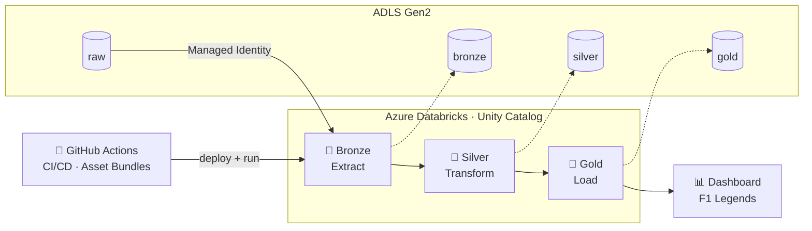
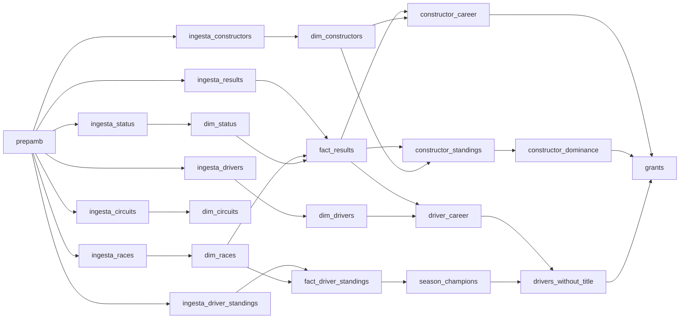
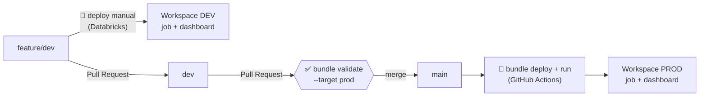
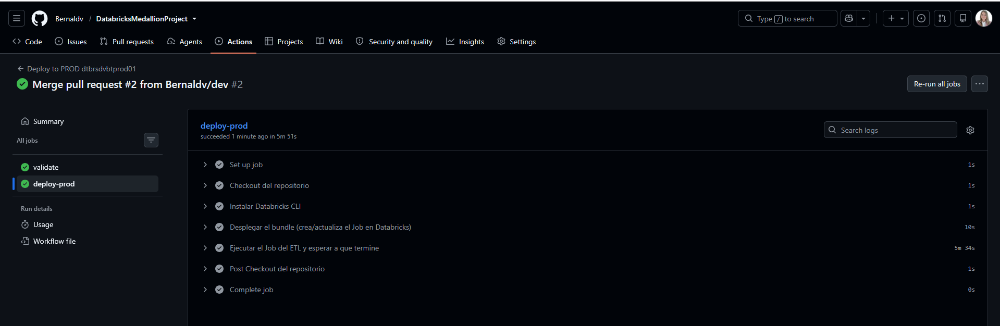
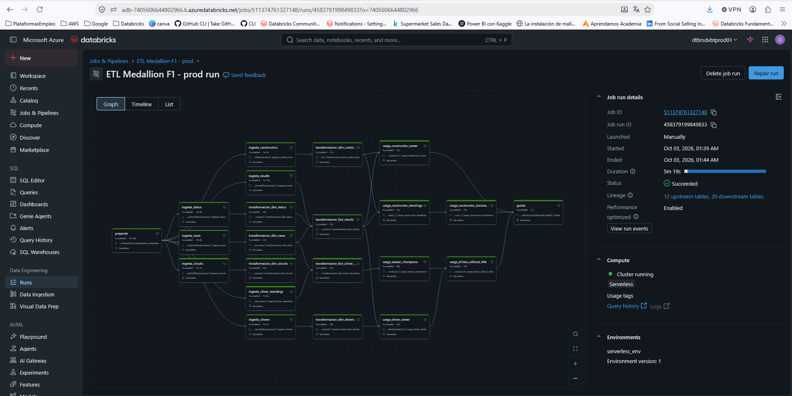

# 🏎️ F1 Legends
#       ETL Medallion con Azure Databricks

Proyecto final del curso **Ingeniería de Datos con Databricks**. Implementa un pipeline ETL completo sobre datos históricos de la Fórmula 1 (1950 – presente) usando la **arquitectura Medallion** (Bronze → Silver → Gold) en **Azure Databricks**, gobernado con **Unity Catalog**, desplegado con **Databricks Asset Bundles** y automatizado de desarrollo a producción con **GitHub Actions (CI/CD)**.

El resultado final es el dashboard **"F1 Legends — Historia y Estadísticas"**, que responde preguntas como: ¿quiénes son los pilotos y escuderías más ganadores?, ¿qué pilotos ganaron mucho pero nunca fueron campeones?, y ¿qué equipos dominaron cada época?

---


## 📊 Dataset

Los datos se tomaron del dataset público de Kaggle **[F1 Dataset — binayas](https://www.kaggle.com/datasets/binayas/f1-dataset)**, que contiene la historia del Campeonato Mundial de Fórmula 1 desde 1950.

Para el ETL se usan **7 insumos** en formato CSV, almacenados en el contenedor `raw` de Azure Data Lake Storage Gen2:

| Archivo | Descripción |
|---|---|
| `circuits` | Circuitos donde se han disputado Grandes Premios |
| `constructors` | Escuderías (constructores) y su nacionalidad |
| `drivers` | Pilotos, nacionalidad y datos personales |
| `races` | Carreras por temporada, ronda y circuito |
| `results` | Resultado de cada piloto en cada carrera |
| `driver_standings` | Clasificación del campeonato de pilotos tras cada carrera |
| `status` | Catálogo de estados de finalización (Finished, Accident, +1 Lap, etc.) |

---

## 🏗️ Arquitectura



**Principios de diseño**

- **Fuente raw en ADLS Gen2**, nunca en DBFS ni en Volúmenes.
- **Conexión a raw exclusivamente con Managed Identity**, mediante un *Access Connector for Azure Databricks* registrado como *Storage Credential* en Unity Catalog, más una *External Location* sobre el contenedor.
- **Cada capa en su propio contenedor** (`raw`, `bronze`, `silver`, `gold`) del Data Lake, expuesto a Unity Catalog mediante external locations.
- **ETL 100 % en PySpark** (API de DataFrames).
- **Dos ambientes aislados** (desarrollo y producción), cada uno con su propio workspace, storage account y catálogo.
- **Cómputo serverless** para el workflow, sin clusters encendidos entre ambientes.

---

<a id="servicios"></a>

## ☁️ Servicios utilizados

| Servicio | Uso en el proyecto | Dev | Prod |
|---|---|---|---|
| **Resource Group** | Agrupa los recursos de cada ambiente | `rgsprojectdev01` | `rgsprojectprod01` |
| **Azure Databricks** | Procesamiento del ETL, workflows y dashboard | `dtbrsdvbtdev01` | `dtbrsdvbtprod01` |
| **Azure Data Lake Storage Gen2** | Contenedores `raw`, `bronze`, `silver` y `gold` | `adlsdvbtdev01` | `adlsdvbtprod01` |
| **Access Connector for Azure Databricks** | Managed Identity para acceder al storage | `accesconnectordev01` | `accesconnectorprod01` |
| **Azure Key Vault** | Almacén de secretos por ambiente | `keyvaultdevdvbt01` | `keyvaultproddvbt01` |
| **Microsoft Entra ID** | Identidad de los usuarios del proyecto | ✔️ | ✔️ |
| **Unity Catalog** | Metastore `project-metastore`, catálogos, external locations y permisos | `catalog_pr_db_dev` | `catalog_pr_db_prod` |
| **Databricks Asset Bundles** | Workflow y dashboard definidos como código (IaC) | ✔️ | ✔️ |
| **Databricks SQL Warehouse** | Ejecuta las consultas del dashboard | `Serverless Starter Warehouse` | `Serverless Starter Warehouse` |
| **GitHub + GitHub Actions** | Versionamiento y CI/CD hacia producción | ✔️ | ✔️ |
| **Databricks AI/BI Dashboard** | Visualización de las tablas gold | ✔️ | ✔️ |

---

## ⚙️ Configuración de la infraestructura

Pasos realizados para aprovisionar y conectar los dos ambientes. Todo se hizo de forma simétrica en **dev** y **prod**.

### 1. Recursos en Azure

1. Se creó un **Resource Group por ambiente**: `rgsprojectdev01` y `rgsprojectprod01`.
2. En cada uno se aprovisionaron:
   - Un workspace de **Azure Databricks** (`dtbrsdvbtdev01` / `dtbrsdvbtprod01`).
   - Un **Data Lake Storage Gen2** (`adlsdvbtdev01` / `adlsdvbtprod01`) con los contenedores `raw`, `bronze`, `silver` y `gold`.
   - Un **Azure Key Vault** (`keyvaultdevdvbt01` / `keyvaultproddvbt01`).
   - Un **Access Connector for Azure Databricks** (`accesconnectordev01` / `accesconnectorprod01`).

### 2. Managed Identity sobre el Data Lake

A cada Access Connector se le asignó el rol **Storage Blob Data Contributor** sobre el storage account de **su mismo ambiente**: *Access control (IAM) → Add role assignment → Managed identity → Access Connector for Azure Databricks*.

Así Databricks lee y escribe en el lago sin claves de acceso ni tokens SAS.

### 3. Unity Catalog

1. Desde **Microsoft Entra ID** se obtuvo el usuario administrador y se ingresó al **Account Console** (`accounts.azuredatabricks.net`).
2. Se creó el metastore **`project-metastore`**, se asignaron a él ambos workspaces y se definió al usuario como administrador.
3. En cada workspace, en *Catalog → External data → Credentials*, se creó una **Storage Credential** con el *Resource ID* del Access Connector del ambiente.
4. El notebook de **preparación de ambiente** ([`PrepAmb/`](./PrepAmb)) crea las **external locations** sobre los contenedores `raw`, `bronze`, `silver` y `gold`, el catálogo del ambiente y sus schemas. Se ejecuta automáticamente como primera tarea del workflow.
5. **Aislamiento de catálogos (workspace binding):** cada catálogo solo es accesible desde su workspace. `catalog_pr_db_dev` solo se ve en dev y `catalog_pr_db_prod` solo en prod, aunque compartan el mismo metastore.

### 4. Usuarios y grupos

En el Account Console se agregaron los usuarios con acceso. En cada workspace, en *Settings → Identity and access*, se creó el grupo de visualización del ambiente (`dbrs_visualization_dev` / `dbrs_visualization_prod`) y se agregaron los usuarios. A ese grupo se le otorgan los permisos de lectura al final del ETL.

### 5. Integración con GitHub

1. Se creó el repositorio con las ramas `feature/dev`, `dev` y `main`.
2. En cada workspace se vinculó la cuenta de GitHub en *Settings → Linked accounts*.
3. Se crearon **Git folders** para trabajar con cada rama: `feature_DatabricksMedallionProject`, `dev_DatabricksMedallionProject` y `main_DatabricksMedallionProject`.

### 6. Databricks Asset Bundle

1. En la Git folder `feature_DatabricksMedallionProject` se creó el bundle **`bund_project_medallion_databricks`**, con `databricks.yml` en la raíz del repositorio.
2. En [`databricks.yml`](./databricks.yml) se definieron las variables (`storage_name`, `credential_name`, `warehouse_id`) y los targets `dev` y `prod`, cada uno apuntando a su workspace.
3. En [`resources/etl_project_refresh.job.yml`](./resources/etl_project_refresh.job.yml) se definieron las tareas del workflow y sus dependencias.
4. En [`resources/f1_legends.dashboard.yml`](./resources/f1_legends.dashboard.yml) se definió el dashboard, de modo que se despliega junto con el workflow en cada ambiente.

### 7. Secrets de GitHub

Se generó un **Personal Access Token** en cada workspace (*Settings → Developer → Access tokens*) y se registró como secret del repositorio, junto con el host. Ver [CI/CD](#-cicd-con-github-actions).

### 8. Carga de datos

Los CSV se cargaron en el contenedor **`raw`** del Data Lake de cada ambiente.

---

## 📁 Estructura del repositorio

```
├── .github/workflows/
│   └── prod_deployment.yml       # CI/CD: valida PR → main y despliega/ejecuta en PROD
├── certificaciones/              # Certificaciones obtenidas (.png + enlace)
├── dashboard/
│   └── f1_legends.lvdash.json    # Definición del dashboard (+ capturas)
├── datasets/                     # Insumos del ETL (CSV de Kaggle)
├── evidencias/                   # Capturas de ejecuciones y servicios en Azure
├── PrepAmb/
│   └── 0_preparacion_ambientes   # Catálogo, schemas, external locations
├── proceso/                      # Notebooks del ETL (lo que se ejecuta en producción)
│   ├── 1_Ingesta_*               # Bronze
│   ├── 2_Transformacion_*        # Silver
│   └── 3_x_Carga_*               # Gold
├── resources/
│   ├── etl_project_refresh.job.yml   # Definición del workflow (Asset Bundle)
│   └── f1_legends.dashboard.yml      # Definición del dashboard (Asset Bundle)
├── reversion/
│   └── 1_Borrado_Ambiente        # Elimina tablas lógicas y rutas físicas
├── seguridad/
│   └── 1_Grants                  # Permisos sobre las tablas gold
├── databricks.yml                # Configuración del bundle: variables y targets dev/prod
└── README.md
```

---

## 🥇 Modelo de datos — Medallion

Todos los ambientes usan la misma estructura. El catálogo cambia según el ambiente (`catalog_pr_db_dev` / `catalog_pr_db_prod`) y los schemas son fijos. Los datos de cada schema se almacenan físicamente en el contenedor del Data Lake con su mismo nombre.

### 🥉 Bronze — Ingesta

Lectura de los CSV desde el contenedor `raw` de ADLS con esquema explícito. Se agregan columnas de auditoría y se guardan como tablas Delta sin aplicar reglas de negocio.

`circuits` · `constructors` · `drivers` · `races` · `results` · `driver_standings` · `status`

### 🥈 Silver — Transformación

Limpieza, tipado, normalización de nulos, renombrado de columnas y modelado dimensional:

| Tipo | Tablas |
|---|---|
| Dimensiones | `dim_circuits`, `dim_constructors`, `dim_drivers`, `dim_races`, `dim_status` |
| Hechos | `fact_results`, `fact_driver_standings` |

### 🥇 Gold — Carga

Tablas agregadas y listas para el consumo analítico:

| Tabla | Contenido |
|---|---|
| `driver_career` | Carrera de cada piloto: victorias, podios, puntos, carreras disputadas, primera y última temporada |
| `constructor_career` | Carrera de cada escudería: victorias, podios, puntos y temporadas activas |
| `constructor_standings` | Clasificación de constructores por temporada (puntos, victorias, podios, posición) |
| `constructor_dominance` | Rachas de dominio: temporadas consecutivas de cada escudería como la mejor del año |
| `season_champions` | Campeón del mundo de pilotos de cada temporada y sus puntos |
| `drivers_without_title` | Pilotos con más victorias que nunca ganaron un campeonato mundial |

---

## 🔄 Workflow del ETL

El workflow **`ETL Medallion F1`** se define como código en [`resources/etl_project_refresh.job.yml`](./resources/etl_project_refresh.job.yml) y corre en **cómputo serverless**. Las ingestas se ejecutan en paralelo, y cada transformación y carga espera solo a las tareas de las que depende.



Los notebooks reciben sus parámetros (`env`, `catalog_base`, schemas, storage) desde el bundle, así que **el mismo código corre en dev y prod** sin modificaciones.

---

## 🔐 Seguridad

- **Acceso a datos con Managed Identity**: sin claves de acceso ni tokens SAS en el código.
- **Unity Catalog** centraliza el control de acceso a catálogos, schemas y tablas.
- **Aislamiento de catálogos:** cada catálogo está vinculado solo al workspace de su ambiente, así que desde dev no se pueden leer ni modificar datos de producción.
- La tarea **`grants`**, al final del workflow, otorga permisos de lectura (`USE CATALOG`, `USE SCHEMA`, `SELECT`) sobre el schema `gold` al grupo de visualización del ambiente correspondiente: `dbrs_visualization_dev` o `dbrs_visualization_prod`.
- Los secretos del CI/CD (host y token de cada workspace) se guardan como **GitHub Secrets** y nunca se escriben en el repositorio.

---

## 🚀 CI/CD con GitHub Actions

El proyecto sigue un flujo de ramas **`feature/dev` → `dev` → `main`**. Desarrollo se despliega manualmente desde Databricks, y producción se despliega automáticamente con GitHub Actions:



| Etapa | Cómo se despliega | Qué hace |
|---|---|---|
| **Desarrollo** (`feature/dev`, `dev`) | Manual, desde el panel *Deployments* del Workspace (target `dev`) | Despliega el job y el dashboard en DEV; el job se ejecuta con *Run* para probar los cambios |
| **PR hacia `main`** | [`prod_deployment.yml`](./.github/workflows/prod_deployment.yml) | Valida el bundle con el target `prod`, sin desplegar |
| **Merge / push a `main`** | [`prod_deployment.yml`](./.github/workflows/prod_deployment.yml) | Despliega el job y el dashboard en PROD, y ejecuta el job |

El workflow de GitHub Actions tiene dos jobs:

1. **`validate`**: corre en cada Pull Request hacia `main` y en cada push. Ejecuta `databricks bundle validate --target prod` para detectar errores de configuración **antes** de llegar a producción.
2. **`deploy-prod`**: solo corre en `main` y solo si la validación pasó. Ejecuta `bundle deploy` y luego `bundle run etl_project_refresh`.

También puede lanzarse manualmente desde la pestaña *Actions* (`workflow_dispatch`), y usa `concurrency` para evitar dos despliegues simultáneos a producción.

El paso `databricks bundle run` espera a que el workflow termine, así que **el Action solo queda en verde si el ETL completo se ejecutó correctamente**. Al terminar, el dashboard de producción ya muestra los datos actualizados.

Las ejecuciones repetidas no duplican información: las tablas se escriben en modo `overwrite`, así que cada corrida reemplaza el contenido anterior.

**Secrets requeridos en GitHub:** `DATABRICKS_DEST_HOST` y `DATABRICKS_DEST_TOKEN`, que corresponden al workspace de producción.

---

<a id="dashboard"></a>

| Workflow | Evento | Acción |
|---|---|---|
| `dev_deployment.yml` | PR hacia `dev` | Valida el bundle con el target `dev` |
| `dev_deployment.yml` | Push / merge a `dev` | Despliega el job en DEV y lo ejecuta |
| `prod_deployment.yml` | PR hacia `main` | Valida el bundle con el target `prod` |
| `prod_deployment.yml` | Push / merge a `main` | Despliega el job en PROD y lo ejecuta |

El paso `databricks bundle run` espera a que el workflow termine, así que **el Action solo queda en verde si el ETL completo se ejecutó correctamente**.

**Secrets requeridos en GitHub:** `DATABRICKS_DEV_HOST`, `DATABRICKS_DEV_TOKEN`, `DATABRICKS_DEST_HOST` y `DATABRICKS_DEST_TOKEN`.

---

## 📈 Dashboard

**F1 Legends — Historia y Estadísticas** es un dashboard de Databricks AI/BI construido sobre las tablas gold. Se definió como código en [`dashboard/f1_legends.lvdash.json`](./dashboard/f1_legends.lvdash.json) y **se despliega con el Asset Bundle**, junto con el workflow, en dev y en prod.

| Sección | Visualización | Tabla gold |
|---|---|---|
| 🏆 Leyendas al volante | Top 10 pilotos por victorias | `driver_career` |
| 🔧 Los mejores equipos de la historia | Top 10 constructores por victorias, coloreados por nacionalidad | `constructor_career` |
| ⏱ Campeones a través del tiempo | Puntos del campeón del mundo en cada temporada | `season_champions` |
| ❌ Grandes sin corona | Pilotos con más victorias que nunca fueron campeones | `drivers_without_title` |
| 👑 Dinastías del paddock | Rachas de dominio de cada escudería | `constructor_dominance` |
| 📊 Clasificación por temporada | Top 5 escuderías del año seleccionado | `constructor_standings` |

Incluye filtros globales **Desde el año / Hasta el año** y un selector de temporada.

### Un mismo dashboard para dev y prod

Las consultas del dashboard no tienen el catálogo escrito: leen `gold.<tabla>`. El catálogo lo define el bundle según el ambiente en [`resources/f1_legends.dashboard.yml`](./resources/f1_legends.dashboard.yml):

```yaml
resources:
  dashboards:
    f1_legends:
      display_name: "F1 Legends — Historia y Estadísticas"
      file_path: ../dashboard/f1_legends.lvdash.json
      warehouse_id: ${var.warehouse_id}
      dataset_catalog: catalog_pr_db_${bundle.target}   # dev → catalog_pr_db_dev | prod → catalog_pr_db_prod
      dataset_schema: gold
      permissions:
        - group_name: dbrs_visualization_${bundle.target}
          level: CAN_READ
```

- **Catálogo por ambiente:** el mismo archivo lee `catalog_pr_db_dev` en dev y `catalog_pr_db_prod` en prod, sin duplicar el dashboard.
- **Warehouse por ambiente:** la variable `warehouse_id` busca el SQL Warehouse por nombre en el workspace de cada ambiente, así que no hay IDs escritos en el código.
- **Permisos:** el grupo de visualización del ambiente recibe acceso de lectura al dashboard, en línea con los grants sobre las tablas gold.

> **Nota:** el archivo `.lvdash.json` abierto directamente desde la Git folder muestra errores de *table not found*, porque fuera del bundle no conoce el catálogo del ambiente. La versión que se consulta es la **desplegada** (botón *View Deployed*). En dev aparece con el prefijo `[dev <usuario>]`.

<!-- Reemplaza con tus capturas -->


---

## ♻️ Reversión del ambiente

El notebook [`reversion/1_Borrado_Ambiente`](./reversion) elimina las tablas lógicas de Unity Catalog y las rutas físicas en ADLS. Permite dejar el ambiente limpio y volver a ejecutar el proyecto desde cero.

---

## ▶️ Cómo ejecutar el proyecto

**Requisitos previos**

1. La infraestructura descrita en [Configuración de la infraestructura](#%EF%B8%8F-configuración-de-la-infraestructura).
2. Los CSV de [`datasets/`](./datasets) cargados en el contenedor `raw`.
3. Databricks CLI instalado (solo para despliegues manuales).

**Despliegue manual**

```bash
databricks bundle validate --target dev
databricks bundle deploy   --target dev
databricks bundle run etl_project_refresh --target dev
```

**Despliegue automático:** hacer merge a `dev` o `main` (ver [CI/CD](#-cicd-con-github-actions)).

---

## 📸 Evidencias

Las capturas están en [`evidencias/`](./evidencias).

<!-- Reemplaza los nombres de archivo por los tuyos -->
| Evidencia | Captura |
|---|---|
| GitHub Actions — deploy a PROD |  |
| Workflow ejecutado correctamente en PROD |  |
| Visualización |  |

---


## 👩‍💻 Autora

**Diana Victoria Bernal Torres**

LinkedIn: (https://www.linkedin.com/in/diana-victoria-bernal-torres)

Fuente de datos: [Kaggle — F1 Dataset (binayas)](https://www.kaggle.com/datasets/binayas/f1-dataset)
